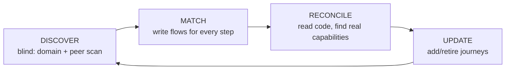
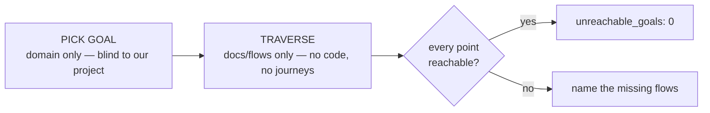

# User journeys — the outside-in perspective

Why this standard exists, one section per `USER_JOURNEYS.md` section.

## Why journeys are modeled outside-in

Flows are enumerated inside-out: you walk the code path (`SCENARIO_ENUMERATION.md`) and describe what the product does. That is the correct discipline for making each flow exhaustive — and it is also a blind spot. Code you wrote can only tell you about intents you already thought to serve. It cannot tell you about the user who shows up expecting something you never built.

A journey fixes the perspective on the person, not the product. It asks: someone in this SaaS category arrives with a need — what is the path they expect to walk? That question is answered by the nature of the domain and by what comparable apps in the same category have taught users to expect, not by reading your own screens back to yourself. Modeling the arriving user, blind to your own offering, is the only way to discover the intents your product is silently failing to serve.

## Why `provenance` is required and `not_derived_from_our_flows` must be true

The failure mode of any "user journey" exercise is quietly transcribing your own feature list into journey language and calling it user-centered. That produces a catalog that agrees with your flows by construction and discovers nothing.

Provenance is the guard. Every journey names the domain and the peer patterns that model its intent. A reviewer can check that the journey came from outside — from what users in this category expect — rather than from a walk of your own flows. A journey with no external provenance is indistinguishable from a back-derived one, so it is non-compliant.

## Why the loop is circular and runs before code

A single outside-in pass is not enough, and a single inside-out pass is not enough. Each sees what the other is blind to:

- **Discover** (blind) finds intents your product does not yet serve.
- **Reconcile** (reading code) finds capabilities your journeys did not anticipate — a real path the implementation makes possible that no journey named.

Feeding each back into the other converges on a catalog that is neither a mirror of your flows nor a fantasy of intents you will never build. It settles on the true intersection: every intent a real user arrives with, every one of them satisfiable, and nothing built that no arriving user needs.

Running it before code is the whole point. Journeys and the flows that satisfy them exist as a complete map before a line is implemented, so implementation derives from a settled understanding of user intent rather than generating it after the fact.

## Why `discover` is a repo-blind subagent, not an inline promise

"Do not look at our flows" is impossible to keep honestly while your own flows sit in your context. The blindness has to be structural. Dispatching the discover phase to a subagent that is handed only the domain and a peer-app scan — with no access to the repo — makes the constraint a property of the setup rather than a rule the author has to remember to obey. This mirrors the reproducibility pattern used elsewhere: a fresh agent given only the inputs it is allowed to see.

## Why reconciliation is bidirectional

`FLOW_CONTRACT#journey-completeness` already enforces the forward direction: every journey step must map to a flow, or the flow set is incomplete. The reverse direction is equally load-bearing and easy to skip. A flow that satisfies no journey is a feature no arriving user needs — scope built for its own sake. Left unchecked it accumulates as bloat that still demands specs, tests, and maintenance.

Making the check bidirectional turns divergence into signal. A forward gap names a missing capability; a reverse gap names an orphan feature. Both are defects, surfaced by the same map.

## Why orphan flows are hard red, not a warning

The project doctrine is "nothing more, nothing less." A warning invites the orphan to survive indefinitely with a shrug. Forcing a binary choice — legitimize it with a real journey, or cut it — keeps the product's surface exactly as large as the intents it serves and no larger. If a real user in the domain would genuinely take that path, writing the journey costs a paragraph and the flow is justified. If no such user exists, the flow should never have been built.

## Why the verdict is binary

The same reasoning as `journey_completeness`: "reconciled?" is a question you can lie to yourself about with "mostly" or "the important ones." One unmapped journey step means a user cannot finish what they came for; one orphan flow means unjustified scope. Either one makes the honest answer NO. A percentage other than 100, or any softening qualifier, dresses a NO as a YES — which the honesty rules forbid.

## Why a well-explained failure counts as a journey achieved

The naive reading of "user journey" stops at the happy path: the user reaches the goal, the journey succeeds; anything else is a failure to be avoided. That reading is wrong, and building to it produces products that dead-end the moment reality intrudes — a taken email, a declined card, an expired token, a lost connection.

A journey is about the user's understanding, not only the user's goal. Someone who tries to register with an already-taken email and is told "that email is already registered — sign in, or reset your password" has completed a coherent journey: they arrived, hit a real condition, understood it, and were handed the next move. They did not get what they came for, and they are not stranded. Contrast the user who submits the form and sees a spinner that never resolves, or a bare `409`. Same underlying condition; one is a finished journey, the other is a hole.

So `failure_outcomes` is a required part of the journey, and `journey_outcomes.explained_failure` fixes the bar: what happened, why, and what next, in language the user reads. The alternative path is required only when a recovery genuinely exists — inventing a dead-end "alternative" to satisfy a checkbox is its own defect. When the failure is truly terminal, a clear explanation is the whole of the obligation. This is the set-level reason `error_terminal` exists in `FLOW_CONTRACT.md`: the flow that serves a step must actually land the user at one of these two terminals, never at a silent stop.

## Why the blind traversal audit exists

Reconciliation is honest but self-referential: it proves the flows cover the journeys *we* wrote. If our imagination of the arriving user was itself incomplete, reconciliation is green and the product still has holes — we never wrote the journey that would have exposed them. The discover phase mitigates this with a repo-blind cartographer, but the cartographer's output still becomes our catalog, and the catalog is what we then reason from.

The blind traversal audit attacks the flow documentation from a direction nothing else does. A fresh mind, told only the SaaS category, invents an arbitrary but realistic goal — a Point A, a Point B, a few waypoints — with no knowledge of what our product does or how. Then it tries to walk that goal using *only* the flow docs: no code, no journeys, no other specs. Every point it cannot reach, and every transition the flow docs do not document, is precisely a thing that is missing — surfaced not by asking "did we cover our list?" but by asking "can a stranger get from here to there with only what we wrote down?"

This is why it runs *after* reconciliation, not instead of it: it is an acceptance test over a set already believed complete, and its whole value is finding the gaps that belief hides. The verdict is binary for the same reason every other completeness verdict is — `unreachable_goals: 0` or a named list of flows to write; "we'll add that later" is the NO answer wearing a smile.

## Why the audit repeats, and repeats down a priority order

One goal, walked once, proves one path — it says nothing about the next. A single blind traversal can pass while the flows still cannot walk the journey a user is ten times more likely to take. So the audit is a repeated exercise: run it again and again, each run a fresh blind pick, until the high-value goal space is covered rather than sampled.

The order matters as much as the repetition. A random walk through the space spends its early runs on obscure goals and reaches the common ones late or never. So the pick is ranked by likelihood × importance × traffic — the intents peer apps and domain conventions show are the most common, the most critical, and the highest-traffic come first. The value of the audit is front-loaded onto the journeys that carry the most users, and the loop stops only when those are exhausted and consecutive runs stop surfacing new gaps (loop-until-dry). This is why the index carries a second terminal line, `priority_goals_uncovered`: `unreachable_goals: 0` alone would let a single obscure-goal run report green over a product that cannot serve its busiest path. Both lines at zero is the only honest done.

The one thing phase one may read is the audit index itself — and only to see which goals are already covered, so each run advances down the backlog instead of re-walking a goal. That is not a leak of how the product works; it is the loop's own bookkeeping.

## Why the two phases are structurally blind

The goal-picker cannot be trusted to "not think about our product" while our product sits in its context, exactly as the discover phase cannot be trusted to ignore our flows. So phase one is handed only the domain and forbidden every repo input, and phase two reads only `docs/flows/`. The blindness is a property of what each phase can see, not a promise it makes. A traversal that peeked at the code would route around documentation gaps using knowledge the flow docs never contained — and report green over a hole. Restricting phase two to the flow docs is what makes an unreachable goal *mean* a missing flow.

## Why journeys feed requirements rather than replace them

Requirements are user-locked and are what autonomous building derives from (`REQUIREMENTS_CONTRACT.md`). Journeys are the outside-in input that shapes them — the evidence of what users in this category expect, brought to the user so the locked requirements reflect real intent rather than internal guesswork. The lock stays with the user and the requirements document stays authoritative; journeys make it better-grounded, they do not become it.

Last updated: 2026-07-25T15:22:50Z

## Overview (migrated from USER_JOURNEYS.md)

# User Journeys

This standard governs how the product models the people who arrive at it — from their perspective, not the product's — and keeps that model reconciled with the flows that serve them, in a loop that runs before any code.

## The perspective

A flow describes what the product does. A journey describes what a user came to do. The two are written from opposite ends. Flows are walked inside-out from the code; journeys are imagined outside-in from the domain — from the nature of this SaaS category and from what comparable apps in the same space have taught users to expect.

The discipline is to model the arriving user *without looking at your own flows*. Reading your own screens back to yourself only re-confirms the intents you already serve. Looking at the domain instead surfaces the intents you are silently missing.

## The two artifacts

- **`docs/journeys/J-<NNN>-<slug>.md`** — one journey: who arrives, what they intend, the steps they expect to walk, what success looks like, and its provenance (the domain and peer patterns that model this intent).
- **`docs/journeys/00-INDEX.md`** — the bidirectional map: every journey step → its flow, and every flow → the journey it serves.

## The loop

1. **Discover** — a repo-blind subagent, given only the SaaS domain and a scan of peer apps, enumerates the journeys a real user arrives with. It cannot see our flows, requirements, or code, so it cannot mirror them.
2. **Match** — for every journey step, a flow must exist. Missing flows get written. A step that maps to no flow is a missing capability.
3. **Reconcile** — read the code and specs, list the flows that actually exist, and surface capabilities the journeys never anticipated. A flow that maps to no journey is an orphan.
4. **Update** — add journeys the code revealed a real user would take, retire ones that no longer fit, and loop.

## The two rules that bite

- **Bidirectional reconciliation.** Every journey step maps to a flow, *and* every flow maps to a journey. A gap in either direction is a defect: a forward gap is a capability the user needs and cannot reach; a reverse gap is a feature no user came for.
- **Orphan flows are hard red.** A flow no journey needs is either legitimized by writing the real journey that takes it, or cut. Nothing more, nothing less.

"Are journeys and flows reconciled?" has exactly two answers. YES means 100% both directions. Anything else is NO — name the gap.

## Success is not the only way to finish

A journey is achieved when the user reaches the goal **or** a well-explained failure. Someone told "that email is already registered — sign in or reset your password" has completed a coherent journey: they hit a real condition, understood it, and were handed the next move. Someone left staring at a spinner or a bare `409` has not.

So every journey carries `failure_outcomes` — each foreseeable way it can fail — and each one states what happened, why, and what next, in the user's language. An alternative path is required only when a real recovery exists; when the failure is genuinely terminal, a clear explanation is the whole obligation. At the flow layer this is `FLOW_CONTRACT`'s `error_terminal` rule: a step is *covered* only when its flow lands the user at success or at one of these explained terminals — never at a silent stop.

## The blind traversal audit

Reconciliation proves the flows cover the journeys *we* wrote. The blind traversal audit proves something stronger: a stranger, told only the SaaS category, can get a user from an arbitrary start to an arbitrary goal using **only** the flow docs.

It runs *after* journeys and flows reconcile, over a set already believed complete — its whole value is finding the gaps that belief hides. Phase one invents a Point A, a Point B, and a few waypoints from the domain alone, knowing nothing about our product. Phase two walks that goal reading only `docs/flows/`. Every point it cannot reach, and every transition the flow docs do not document, is exactly a missing flow.

**It repeats, and it repeats in priority order.** One goal walked once proves one path. So run it again and again — each run a fresh blind pick — ranking goals by likelihood × importance × traffic so the most common, most critical, highest-traffic journeys are covered first. Loop until the high-value space is covered, not sampled: `unreachable_goals: 0` **and** `priority_goals_uncovered: 0`, with two consecutive runs finding no new gap. One run is not the exercise; a gap or an un-audited high-priority goal names the work left.

## Where journeys sit

Journeys are the outside-in input that shapes the user-locked requirements; the user still locks `REQUIREMENTS.md`, and journeys make it reflect real intent rather than internal guesswork. This catalog is the authoritative journey list that `FLOW_CONTRACT` traces its set-level completeness against, and the coverage source the site blueprint cites.

Last updated: 2026-07-25T15:22:50Z

