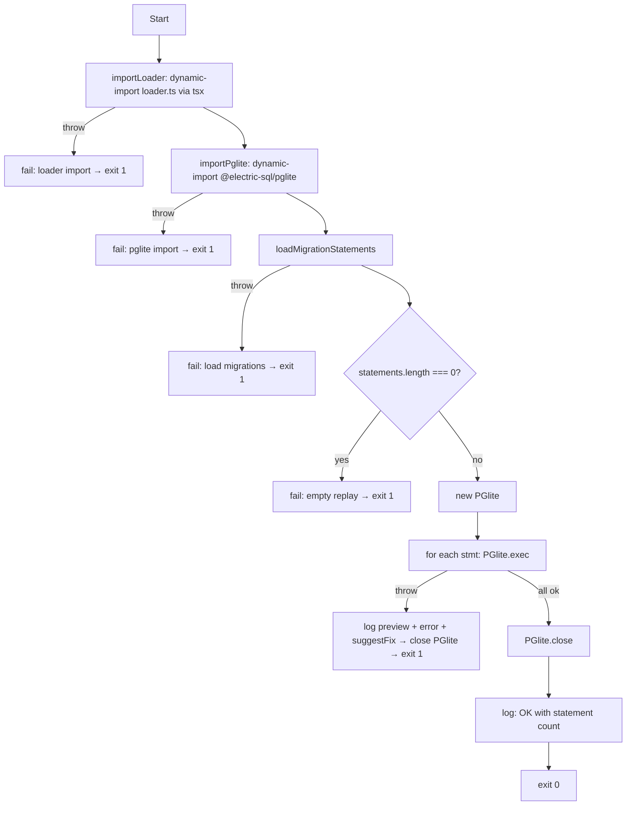

# Migration replay run

## Diagram

## Pre-conditions

- The script is invoked via `pnpm verify:migration-replay` or via `scripts/verify-all.mjs` — both use `node --import tsx` so tsx provides the TypeScript loader.
- `src/db/migrations/` exists and carries at least one `.sql` file.
- `@electric-sql/pglite` is installed (it is a devDependency).

## Sequence

1. `importLoader` dynamically imports `src/db/migrations/loader/loader.ts` via `pathToFileURL`. On failure, exit 1 with the loader-import error message.
2. `importPglite` dynamically imports `@electric-sql/pglite` and returns the `PGlite` constructor. On failure, exit 1 with the install-hint message.
3. `loadMigrationStatements()` returns a flat ordered array of SQL statements (the loader handles file-order, splitting on `--> statement-breakpoint`, trimming, and filtering pglite-incompatible patterns from `INCOMPATIBLE_PATTERNS`).
4. If the returned array is empty, exit 1 with the empty-replay refusal message.
5. Instantiate `new PGlite()` (in-memory).
6. For each statement, `await client.exec(stmt)`; increment the executed counter on success. On the first throw, log the statement preview + Postgres error + suggested fix, close the pglite client, and exit 1.
7. After every statement applies, call `client.close()` and log the success line with the executed count.
8. Exit 0.

## Branch points

- Step 1: loader import fails → exit 1 with the loader-import error.
- Step 2: pglite import fails → exit 1 with the pglite-import error.
- Step 3: loader throws (e.g. ENOENT on the migrations directory) → exit 1 with the load-migrations error.
- Step 4: zero statements → exit 1 with the empty-replay refusal.
- Step 6: any statement throws → close the pglite client, exit 1 with the focused error message.

## Failure paths

- Pglite is missing from `node_modules` (incomplete install) → import fails at step 2; the script prints the `pnpm install` hint.
- The migrations directory is missing → the loader's `readdir` throws ENOENT; the script catches it at step 3 with "failed to load migrations".
- A new migration uses a pglite-incompatible DDL (today the canonical case is `CREATE EXTENSION vector`) → step 6 throws; the suggestFix branch picks the `CREATE EXTENSION` hint and tells the developer to add the substring to `INCOMPATIBLE_PATTERNS` in the loader.
- A migration emits a statement pglite cannot parse for a reason other than the known patterns → the generic fix hint fires.
- `PGlite.close()` itself throws after a successful run → unhandled; the process exits non-zero. This is rare enough that we do not add a try/catch around the close (which would mask other defects).

## Post-conditions

- On success: the pglite database is closed and the script exits 0; nothing on disk has changed.
- On failure: the offending statement, Postgres error, and suggested fix are printed to stderr; the script exits 1. The pglite database is closed in the statement-execution branch; in the import / load-migrations / empty branches the pglite instance was never created and there is nothing to close.
- `verify-all.mjs` aggregates this script's exit code into the overall `pnpm verify` result.
