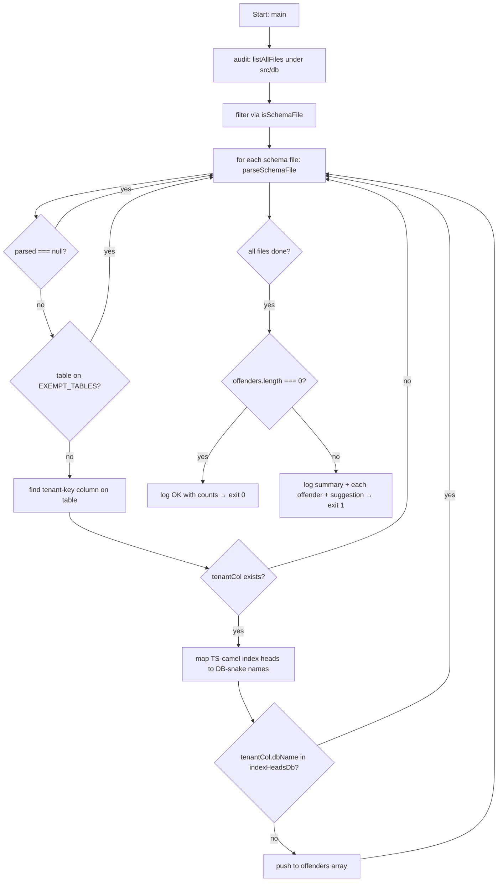

# Tenant-index verifier run

## Diagram

## Pre-conditions

- The script is invoked via `pnpm verify:tenant-indexes` or via `scripts/verify-all.mjs` (no `--import tsx` needed — the script is plain Node + zero TS imports).
- `src/db/` exists and contains at least one Drizzle schema file under a `schemas/` directory. An empty `src/db/` exits 0 with "0 tenant-scoped tables checked"; this is by-design a no-op success.

## Sequence

1. `audit()` calls `listAllFiles(SCHEMA_GLOB_ROOT)` to walk every file under `src/db/`.
2. The walk result is filtered via `isSchemaFile` — keep only `*.ts` files under a `schemas/` directory and outside `__tests__/` / `__specs__/`.
3. For each surviving file, `parseSchemaFile` is called.
4. `parseSchemaFile` runs the table-name regex; if no `pgTable("name",` match, returns `null` and the file is skipped silently.
5. `parseSchemaFile` collects every column declaration via the column-declaration regex (recognized constructors: `uuid`, `text`, `boolean`, `integer`, `bigint`, `timestamp`, `jsonb`, `date`). Each entry carries `{ tsName, dbName }`.
6. `parseSchemaFile` collects every index head — the leading column referenced by `index(...).on(t.<col>, ...)`, `uniqueIndex(...).on(t.<col>, ...)`, `unique(...).on(t.<col>, ...)`, and `primaryKey({ columns: [t.<col>, ...] })`. It also region-scans each column declaration for column-level `.primaryKey()` / `.unique()` chains and adds the column to the heads list.
7. Back in `audit()`, if the table name is in `EXEMPT_TABLES` (today: `users`), skip.
8. Find the tenant key column — the first column in the parsed list whose `dbName` is in `TENANT_KEY_COLUMNS` (`creator_id`, `tenant_id`, `owner_id`, `user_id`). If none, skip.
9. Build a TS-camel → DB-snake map from the parsed columns. Translate each index head into its DB-snake form.
10. If the tenant column's `dbName` is in the translated heads, the table is OK. Otherwise, push an offender entry.
11. After every file is processed, return the audit findings.
12. `main()` inspects the audit result. On zero offenders, log the OK line and return (exit 0).
13. On any offender, log the summary line and, for each offender, the table name + file path + tenant key + observed heads + a one-line copy-pasteable suggestion built via `camelCase`. Exit 1.

## Branch points

- Step 4: `pgTable(...)` not found → file is a barrel re-export; skipped silently.
- Step 7: table on `EXEMPT_TABLES` → skipped.
- Step 8: no tenant-key column on the table → skipped.
- Step 10: tenant key IS in the index-heads list → table OK, no offender entry.
- Step 12 vs 13: zero offenders → exit 0; any offender → exit 1.

## Failure paths

- A schema file uses a column constructor not in the recognized list (e.g. a future `numeric(...)` column) → that column is silently omitted from the columns map. If the column happens to be the tenant key, the table is silently flagged as "no tenant key" — a false negative. The fix is to extend the constructor list in the parser; the script's narrow heuristic is documented in `spec.md`.
- A schema file declares the `pgTable` name dynamically (e.g. via a const) → the table-name regex fails; the file is skipped silently. The locked codebase style is `pgTable("literal-name", ...)`; if a dynamic form is introduced, the parser needs updating.
- The walk fails (e.g. `src/db/` missing) → `listAllFiles` silently swallows `readdirSync` errors and returns the partial list. The audit sees zero tenant-scoped tables and exits 0 with the no-op success line. This is by-design — the migration-replay verifier already covers the empty-`src/db/` defect.

## Post-conditions

- On success: stdout has one OK line; exit 0; the working tree is unchanged.
- On failure: stderr has the summary + per-offender block + suggestion; exit 1.
- `verify-all.mjs` aggregates this script's exit code into the overall `pnpm verify` result.
