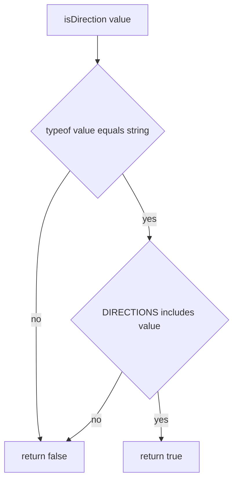

# isDirection

## Diagram

## Pre-conditions

- None. `isDirection` accepts literally any value (`unknown`) and never throws.

## Sequence

1. `typeof value === 'string'` is checked first. Any non-string short-circuits to `false`.
2. `(DIRECTIONS as readonly string[]).includes(value)` checks membership against the 4-element
   frozen array (`'TD' | 'BT' | 'LR' | 'RL'`).
3. The boolean result of step 2 is returned directly.

## Branch points

- Step 1: `value` is not a string (e.g. `undefined`, an object) → returns `false` without
  touching `DIRECTIONS`.
- Step 2: `value` is a string but not one of the 4 legal members — this includes the empty string
  `''` AND the real Mermaid direction token `'TB'` (this package deliberately does NOT alias `'TB'`
  to `'TD'`) → returns `false`.
- Step 2: `value` is a string and IS one of the 4 legal members → returns `true`, narrowing
  `value: unknown` to `value: iDirection` at the call site.

## Failure paths

- None. `throws: []` — every input produces a plain boolean; there is no error path beyond the
  `false` return.

## Post-conditions

- On `true`: the caller's static type for `value` narrows to `iDirection`; no mutation occurred.
- On `false`: nothing is narrowed or mutated; `parseFlowchart` (the sole known caller) falls back
  to its own default direction when this returns `false`.
