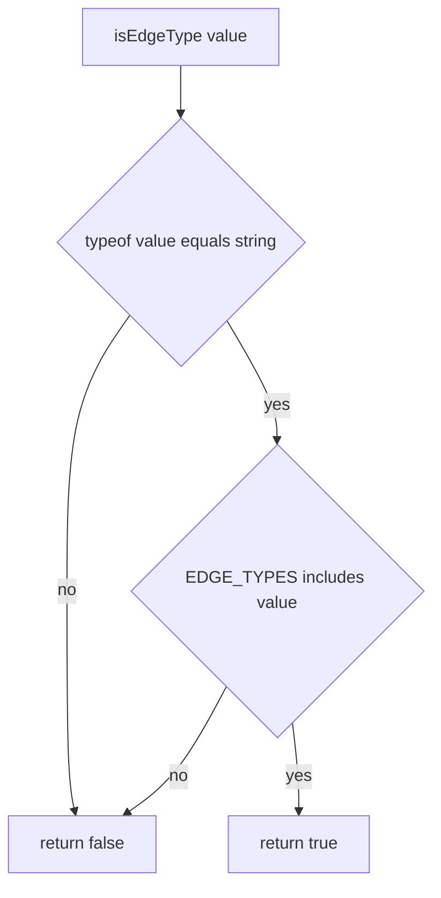

# isEdgeType

## Diagram

## Pre-conditions

- None. `isEdgeType` accepts literally any value (`unknown`) and never throws.

## Sequence

1. `typeof value === 'string'` is checked first. Any non-string short-circuits to `false`.
2. `(EDGE_TYPES as readonly string[]).includes(value)` checks membership against the 4-element
   frozen array (`'happy' | 'warning' | 'error' | 'default'`).
3. The boolean result of step 2 is returned directly.

## Branch points

- Step 1: `value` is not a string (e.g. `null`, a number, an object) → returns `false` without
  touching `EDGE_TYPES`.
- Step 2: `value` is a string but not one of the 4 legal members (e.g. `'dotted'`) → returns
  `false`.
- Step 2: `value` is a string and IS one of the 4 legal members → returns `true`, narrowing
  `value: unknown` to `value: iEdgeType` at the call site.

## Failure paths

- None. `throws: []` — every input produces a plain boolean; there is no error path beyond the
  `false` return.

## Post-conditions

- On `true`: the caller's static type for `value` narrows to `iEdgeType`; no mutation occurred.
- On `false`: nothing is narrowed or mutated; `parseFlowchart` (the sole known caller) falls back
  to its own default edge type when this returns `false`.
