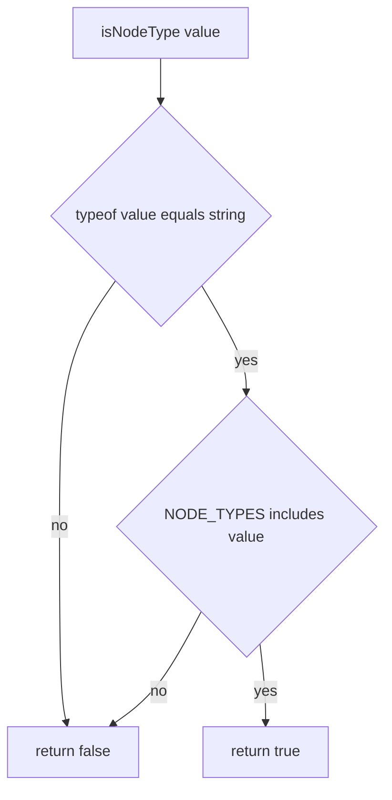

# isNodeType

## Diagram

## Pre-conditions

- None. `isNodeType` accepts literally any value (`unknown`) and never throws, so there is nothing
  the caller must set up first.

## Sequence

1. `typeof value === 'string'` is checked first. Any non-string short-circuits to `false`.
2. `(NODE_TYPES as readonly string[]).includes(value)` checks membership against the 7-element
   frozen array (`'start' | 'end' | 'action' | 'decision' | 'error' | 'warning' | 'link'`).
3. The boolean result of step 2 is returned directly — no transformation, no normalization.

## Branch points

- Step 1: `value` is not a string (number, boolean, null, undefined, object, array) → returns
  `false` without ever touching `NODE_TYPES`.
- Step 2: `value` is a string but not one of the 7 legal members → returns `false`.
- Step 2: `value` is a string and IS one of the 7 legal members → returns `true`, and the TS
  compiler narrows `value: unknown` to `value: iNodeType` in the calling branch.

## Failure paths

- None. The function has no `throws` — every input, however malformed, produces a plain
  boolean. There is no error path to enumerate beyond the `false` return itself.

## Post-conditions

- On `true`: the caller's static type for `value` is narrowed to `iNodeType` for the remainder of
  the enclosing conditional block; no mutation occurred anywhere.
- On `false`: nothing is narrowed, nothing is mutated, nothing is logged — the caller decides how
  to handle the rejection (e.g. `parseFlowchart` falls back to a default node type).
