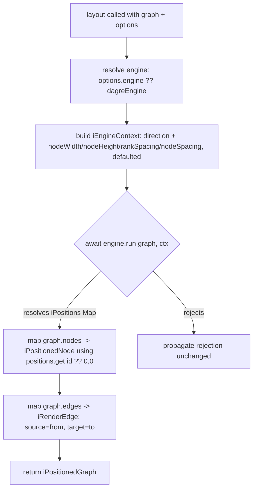

# AA-001 — layout()

What this flow does: given a flowchart's IR (its nodes, edges, and direction) and
some optional tuning, this step computes an on-screen x/y position and a size for
every node, ready to hand to a renderer. It never draws anything itself — it just
does the geometry math, defaulting to a fast built-in engine (dagre) but letting the
caller swap in a fancier one (ELK) when asked.

Feature: layout (AA) · flow 1 of 4

Machine contract: `code/package/src/layout/__specs__/flows/layout.flow.yaml`

