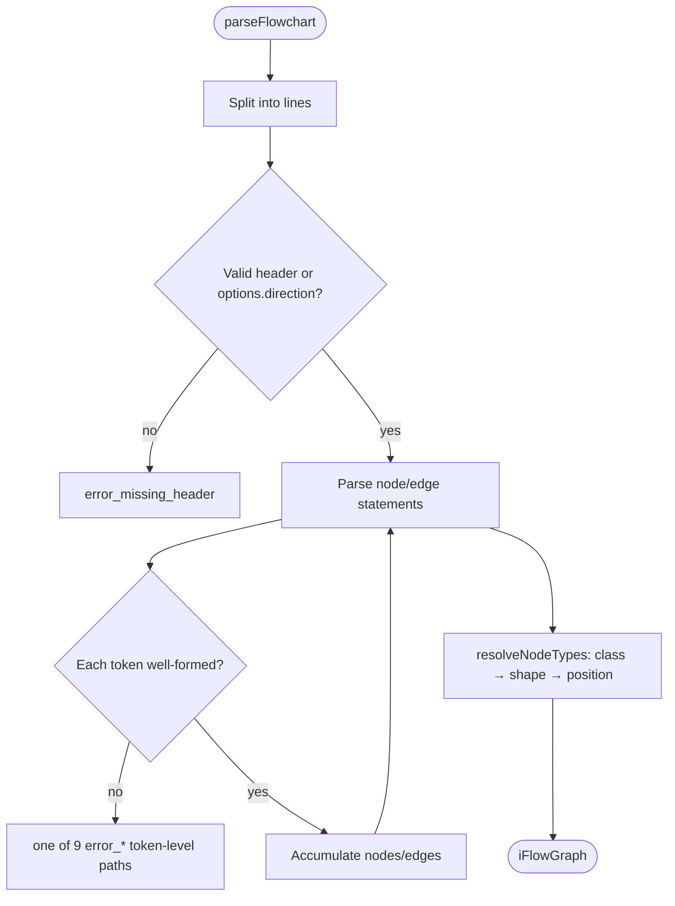

# AA-001 — Parse flowchart DSL text into the IR

What this flow does: takes a Mermaid-like flowchart text (a header line naming a direction, then
node/edge statements) and compiles it into the library's typed graph object. If anything in the
text is malformed, it stops immediately and reports exactly which line and column the problem is
on and why — it never hands back a half-built graph.

Feature: parse (AA) · flow 1 of 2

Machine contract: src/parse/__specs__/flows/parse-flowchart.flow.yaml

