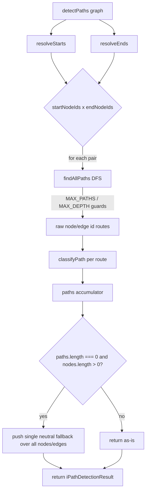

# detectPaths — semantic path detection

What this flow does: given a flowchart (nodes + directed, semantically-typed edges), find every
distinct route from a start point to an end point, and label each route "happy", "warning",
"error", or "neutral" depending on what kind of edges it crosses. If the diagram has no clear start
or end (for example, everything loops back on itself), return one catch-all route over the whole
diagram instead of nothing.

Feature: paths (PA) · flow 1 of 1

Machine contract: src/paths/__specs__/flows/detect-paths.flow.yaml

